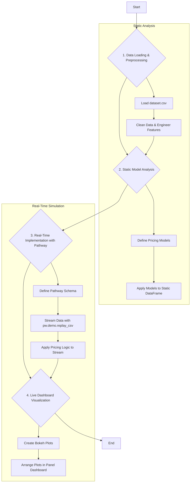

# Dynamic Pricing for Urban Parking Lots

This project, part of the Summer Analytics 2025 capstone, implements a real-time dynamic pricing engine for 14 urban parking lots. The system adjusts parking prices based on a variety of real-time data streams, including occupancy, queue length, traffic conditions, and competitor pricing. The entire pipeline is built using Python, with Pathway for stream processing and Bokeh for live dashboard visualization.

## Technologies Used

- **Python**: Core programming language.
- **Pandas & NumPy**: For data manipulation and numerical computation.
- **Pathway**: For building the real-time data processing pipeline.
- **Bokeh & Panel**: For creating the live, interactive dashboard.
- **Google Colab**: As the development and execution environment.

## Project Workflow

The project follows a structured workflow, from initial data analysis on a static dataset to a full-fledged real-time simulation.

### Step-by-Step Breakdown

1.  **Setup and Imports**: The environment is prepared by installing and importing all necessary packages, including `pathway`, `bokeh`, `pandas`, and `numpy`.

2.  **Data Loading and Preprocessing**:
    *   The historical parking data (`dataset.csv`) is loaded into a Pandas DataFrame.
    *   Columns are renamed for better readability.
    *   Data is cleaned by handling missing values.
    *   Feature engineering is performed to create new, more informative features such as `occupancy_rate`, `traffic_level`, and `vehicle_type_weight`.

3.  **Model Training & Static Analysis**:
    *   **Demand Function**: A mathematical function was created to quantify demand based on weighted inputs like occupancy rate, queue length, traffic, and special day indicators.
    *   **Demand-Based Pricing**: This model normalizes the calculated demand and adjusts a base price accordingly. The price is clipped to stay within a reasonable range (50% to 200% of the base price).
    *   **Competitive Pricing**: This model further refines the demand-based price by factoring in simulated competitor prices, making the system more adaptive to market conditions.
    *   These models were first applied to the static dataset to analyze their behavior and validate the logic.

4.  **Real-Time Implementation with Pathway**:
    *   The validated pricing logic was deployed to a real-time streaming context using Pathway.
    *   A `ParkingData` schema was defined to structure the incoming data stream.
    *   `pw.demo.replay_csv` was used to simulate a live data feed from the preprocessed historical data.
    *   The demand function and pricing models were applied to the stream, with Pathway handling the continuous, real-time calculations and state management (like calculating streaming min/max for normalization).

5.  **Live Dashboard Visualization**:
    *   A real-time dashboard was built using Bokeh and Panel to visualize the output of the Pathway simulation.
    *   The dashboard features separate line plots for each of the 14 parking lots, showing the calculated `demand_price` and `competitive_price` as they update over time.

6.  **Running the Simulation**:
    *   The final step is to execute `pw.run()`, which starts the Pathway simulation and brings the live dashboard to life.

## How to Run

1.  Open the `Dynamic_Parking_Pricing_Colab.ipynb` notebook in Google Colab.
2.  Upload the `dataset.csv` file when prompted by the upload cell.
3.  Run all the cells in the notebook sequentially.
4.  The final cell, `pw.run()`, will start the simulation, and the dashboard in the preceding cell will begin to display live price updates.
